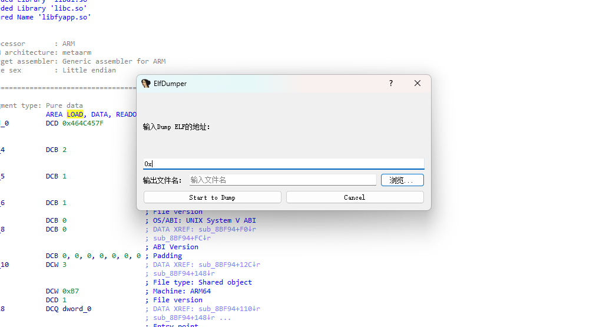

# ElfDumper

An IDA Pro 9.0 plugin for dumping ELF binaries from memory. Automatically detects ELF class (x86 / x64) and reconstructs the binary from memory segments.

Ideal for extracting unpacked, decrypted, or runtime-modified ELF executables and shared libraries during dynamic debugging.



## Features

- **Auto-detect architecture** — automatically identifies 32-bit or 64-bit ELF by reading `EI_CLASS`
- **GUI dialog** — input base address and output file path via a native IDA dialog (`Ctrl+Shift+D`)
- **Segment dump** — dumps `PT_LOAD` and `PT_DYNAMIC` segments from IDA memory
- **Reconstructs ELF** — writes segments at correct file offsets to produce a valid ELF binary
- **Lightweight** — pure IDAPython, zero external dependencies

## Requirements

- IDA Pro 9.0+ (with IDAPython)

## Installation

### As a Plugin (Recommended)

Copy `ElfDumper.py` to your IDA plugins directory:

```
<IDA_DIR>/plugins/ElfDumper.py
```

Then use the hotkey **Ctrl+Shift+D** or **Edit → Plugins → ElfDumper** to launch.

### As a Script

**File → Script file...** → select `ElfDumper`

### Standalone Scripts

You can also use the individual scripts directly in IDA's Python console:

```python
import DumpELF_x64
DumpELF_x64.main(0x400000, "output.dump")

import DumpELF_x86
DumpELF_x86.main(0x8048000, "output.dump")
```

## Usage

1. Open the target binary in IDA Pro and start a debug session
2. Pause at a point where the ELF is fully unpacked/decrypted in memory
3. Press **Ctrl+Shift+D** (or run the script)
4. Enter the ELF base address and output file path in the dialog
5. Click **Start to Dump**

The plugin will auto-detect the ELF class and dump all loadable segments.

## How It Works

1. Reads `EI_CLASS` (offset `0x04`) to determine 32-bit or 64-bit ELF
2. Parses the ELF header to locate the Program Header Table
3. Iterates through program headers, filtering `PT_LOAD` (type 1) and `PT_DYNAMIC` (type 2)
4. Copies each segment's memory content to the output file at the correct file offset
5. Produces a reconstructed ELF binary for further static analysis

## Use Cases

- Dumping packed/encrypted ELF binaries after runtime unpacking
- Extracting decrypted native libraries (`.so`) from Android apps
- Capturing runtime-modified ELF binaries during dynamic analysis
- Recovering executables protected by custom packers/protectors

## Project Structure

```
ElfDumper/
├── ElfDumper.py      # Main plugin (auto-detect, GUI, hotkey)
├── DumpELF_x64.py    # Standalone 64-bit ELF dumper
├── DumpELF_x86.py    # Standalone 32-bit ELF dumper
├── screenshots/
│   └── demo.png      # Plugin demo screenshot
├── LICENSE
└── README.md
```

## License

MIT License — see [LICENSE](LICENSE) for details.

## Author

**LeoChen**
